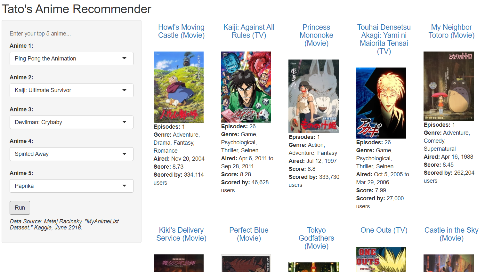

[Click here for R Shiny App.]()

## Next Steps

* **Collect more data:** the MyAnimeList data on Kaggle was last updated in 2018 and does not have anime from the last four years. Consider scraping MyAnimeList or using its API to collect additional data.

* **Refine recommender:** consider removing sequels to increase the likelihood of recommending a show that the user doesn't already know about. Also consider adding settings to let users filter to series/movies/OVAs, to ongoing/completed anime, to anime from certain years or genres, etc. 

* **Improve usability:** refine the R Shiny app to improve usability of the website.