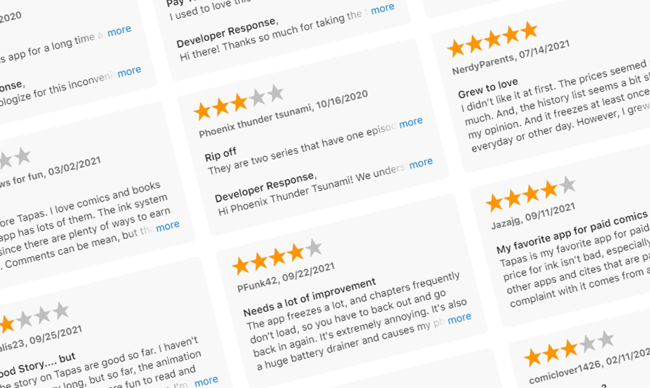
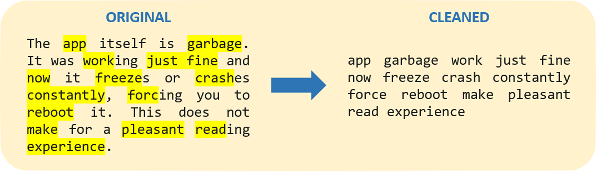
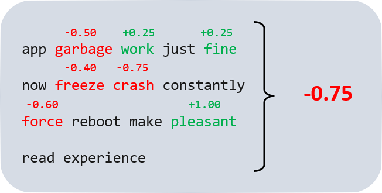
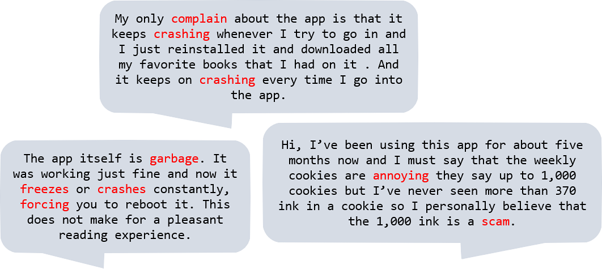

[Click here for code on GitHub.](https://github.com/tomatatoro/personal-webpage/blob/main/content/post/text-mining-app-store-reviews/index.Rmd)

The goal of this project is to see **what the user experience has been like with the [Tapas app](https://apps.apple.com/us/app/tapas-comics-and-novels/id578836126),** one of my favorite webtoon apps. Specifically, I answer the following questions:

* **How have ratings changed for the Tapas app over the past few months?**

* **What's the #1 problem that users experience with the Tapas app?**

* **Has Tapas dealt with the problem, and if so, did it work?**

## Setup and Loading Data

```{r, include = FALSE}
# Package names
packages <- c('appler', 'dplyr', 'lubridate', 'ggplot2', 'stringr', 'tidyr', 'tm', 'textclean', 'textstem', 'syuzhet', 'udpipe',
              'tidytext', 'igraph', 'ggraph', 'gridExtra', 'wesanderson', 'colorspace', 'ggrepel')

# Install packages not yet installed
installed_packages <- packages %in% rownames(installed.packages())
if (any(installed_packages == FALSE)) {
  install.packages(packages[!installed_packages])
}

# Packages loading
invisible(lapply(packages, library, character.only = TRUE))

# Package names
# library(appler)
# library(dplyr)
# library(lubridate)
# library(ggplot2)
# library(stringr)
# library(tidyr)
# library(tm)
# library(textclean)
# library(textstem)
# library(syuzhet)
# library(knitr)
# library(udpipe)
# library(tidytext)
# library(igraph)
# library(ggraph)
# library(ggplot2)
# library(gridExtra)
# library(wesanderson)
# library(colorspace)
# library(wordcloud)
# library(ggrepel)

#Set common colors to use throughout the post.
blue <- wesanderson::wes_palettes$Zissou1[1]
red <- wesanderson::wes_palettes$Royal1[2]
lightred <- lighten(red, amount = 0.5, method = 'relative', space = 'combined')
green <- wesanderson::wes_palettes$Royal2[5]
yellow <- wesanderson::wes_palettes$Royal2[4]
lightblue <- lighten(blue, amount = 0.5, method = 'relative', space = 'combined')
```

To start, I use the **appler** package to download the latest user reviews for the Tapas app. I downloaded this data as of October 24, 2021.

(_disclaimer: the App Store API only allows users to download the latest 500 reviews, which is a limitation of this case study._)

```{r, eval = FALSE}
# App store ID can be found in the app store URL: https://apps.apple.com/us/app/tapas-comics-and-novels/id578836126
# reviews <- appler::get_apple_reviews(578836126, country = 'us', all_results = TRUE)
```

```{r, include = FALSE}
# To ensure replicability, I saved the App Store reviews I downloaded on October 24, 2021.
# saveRDS(reviews_raw, file = 'app_reviews.rds')
reviews <- readRDS('app_reviews.rds')
```

After downloading the data, we can take a peek at the dataset.
```{r, echo = FALSE, message = FALSE}
glimpse(reviews)
```
Our dataset has 500 rows and 7 variables, where each row represents one review. Each row contains data on the review rating, when the review was written, the app version at the time, and the review itself.

## How have ratings changed for the Tapas app over the last few months?

To start our exploratory analysis, I look at the distribution of reviews over time. 
```{r, echo = FALSE, message = FALSE}
# Clean dates and add a flag for which months to highlight on the chart.
reviews <- reviews %>% 
  mutate(review_time = as.Date(review_time), 
         month = lubridate::floor_date(review_time, 'month'),
         month_flag = month < '2021-05-01')

# Get count of reviews by month.
monthly_count <- reviews %>% group_by(month, month_flag) %>% summarize(n = n())

# Calculate the observation that 288 out of 500 reviews are from before May 2021.
proportion <- monthly_count %>% 
  group_by(month_flag) %>% 
  summarize(total_n = sum(n)) %>% 
  filter(month_flag == TRUE) %>% 
  select(total_n)

# Plot count of reviews by month.
my_palette <- c(lightblue, blue)

ggplot(monthly_count, aes(x = month, y = n, fill = month_flag)) + 
  geom_bar(stat = 'identity') + 
  labs(title = "58% of reviews (288 out of 500) are from Feb - Apr.",
       subtitle = "Monthly Count of Reviews",
       x = 'Month', 
       y = 'Count of Reviews') +
  theme_light() +
  theme(panel.grid.major = element_blank(), 
        panel.grid.minor = element_blank(), 
        legend.position = 'none') +
  scale_fill_manual(values = my_palette) +
  ylim(0, 150) + 
  scale_x_date(date_breaks = "1 month", date_labels =  "%b %y") +
  geom_text(aes(label = n), vjust = -0.5)
```

Interestingly, the majority of reviews are from early 2021, and it seems like fewer and fewer people left reviews for Tapas in recent months. People tend to be more likely to leave reviews if they have strong negative feedback, so this could be an indication of improvements in the app. The next thing I'd like to look at is the average rating over time.

```{r, echo = FALSE, message = FALSE}
# Calculate average rating by month and add a flag for which months to highlight.
avg_rating <- reviews %>% 
  mutate(month_flag = case_when(
    month %in% as.Date(c('2021-08-01', '2021-09-01', '2021-10-01')) ~ TRUE,
    T ~ FALSE
  )) %>%
  group_by(month, month_flag) %>% 
  summarize(avg_rating = mean(rating))

# Plot average rating by month.
my_palette <- c(lightblue, blue)

ggplot(avg_rating, aes(x = month, y = avg_rating, fill = month_flag))+
  geom_bar(stat = 'identity') +
  labs(title = 'Average ratings grew through Jul and fell from Aug - Oct.',
       subtitle = 'Average Rating by Month',
       x = 'Month', 
       y = 'Average Rating') + 
  theme_light() +
  theme(panel.grid.major = element_blank(), 
        panel.grid.minor = element_blank(), 
        legend.position = 'none') +
  ylim(0, 5) +
  scale_x_date(date_breaks = "1 month", date_labels =  "%b %y") +
  scale_fill_manual(values = my_palette) +
  geom_text(aes(label = formatC(avg_rating, format = 'f', digits = 2)), vjust = -0.8)
```

Indeed, the Tapas app has generally improved over time. The average rating was growing steadily up until July 2021. But from August on, ratings took a dip, and by September, the average rating was essentially back where it started around the beginning of 2021. The App Store provides data on app versions, so we can also look at ratings across different app versions. 

```{r, echo = FALSE}
# Clean app version.
reviews <- reviews %>% mutate(app_version_clean = stringr::str_extract(as.character(app_version), '5\\.[0-9]{1,2}'))

# Order app versions in chronological order.
app_ver_order <- reviews %>% 
  select(app_version_clean) %>%
  unique() %>% 
  arrange(as.integer(substr(app_version_clean, 3, nchar(app_version_clean)))) %>%
  unlist()

reviews <- reviews %>% mutate(app_version_clean = factor(app_version_clean, levels = app_ver_order))
```

```{r, include = FALSE, message = FALSE}
# This chart isn't used in the data story, but shows the timeline of when each app version was rolled out.
version_count <- reviews %>% 
  group_by(app_version_clean, month) %>% 
  summarize(n_reviews = n()) %>%
  ungroup() %>%
  tidyr::complete(app_version_clean, month, fill = list(n_reviews = 0)) %>%
  arrange(app_version_clean)

version_prop <- version_count %>% 
  group_by(month) %>% 
  mutate(percentage = n_reviews/sum(n_reviews))

ggplot(version_prop, aes(x = month, y = percentage, fill = app_version_clean)) + 
  geom_area() + 
  labs(title = 'Ver. 5.10 was the active version around September.',
       subtitle = 'Version Rollouts Over Time',
       x = 'Month', 
       y = 'Percent of Reviews') +
  theme_light() +
  theme(panel.grid.major = element_blank(), 
        panel.grid.minor = element_blank()) +
  scale_x_date(date_breaks = "1 month", date_labels =  "%b %y") +
  scale_y_continuous(labels = scales::percent) + 
  scale_fill_discrete(name = 'App Version') + 
  geom_vline(xintercept = as.Date('2021-09-01'),
             linetype = 'dotted',
             size = 1.5)
```

When we plot average ratings by app version, we can see a dip in ratings around version 5.10. 
```{r, echo = FALSE}
# Calculate average rating by app version.
avg_rating_by_ver <- reviews %>% 
  group_by(app_version_clean) %>%
  summarize(avg_rating = mean(rating)) %>%
  arrange(app_version_clean)

# Plot average rating by app version
ggplot(avg_rating_by_ver, aes(x = app_version_clean, y = avg_rating)) + 
  geom_bar(stat = 'identity', fill = blue) +
  labs(title = 'Average ratings peaked with ver. 5.9 and fell with ver. 5.10.',
       subtitle = 'Average Rating by App Version',
       x = 'App Version', 
       y = 'Average Rating') +
  theme_light() +
  theme(panel.grid.major = element_blank(), 
        panel.grid.minor = element_blank(),
        legend.position = 'none') +
  scale_fill_manual(values = my_palette) +
  ylim(0, 5) +
  geom_text(aes(label = formatC(avg_rating, format = 'f', digits = 2)), vjust = -0.8)
```

So to summarize our findings...

Q: How have ratings changed for the Tapas app over the past few months?

A: Through exploratory analysis, we discovered that **ratings improved through the release of version 5.9 in July, but fell in recent months for versions 5.10-5.12**.

## What's the #1 problem that users have with the Tapas app?

Now that we see the trend in ratings, my next question would be to look at the negative reviews and try to identify what's the #1 problem users are dealing with. 

### Identifying Negative Reviews

We could simply use reviews with low star ratings to identify negative reviews, but there are also four- or five-star reviews that sometimes include hidden criticisms of the app, or as I call them: "I love it, but..." reviews. For example, this 5-star review talks about an issue with the app crashing. If we did a simple filter on rating, we wouldn't capture a review like this, where the user rated the app 5 stars but complains about the app crashing. 

```{r, echo = FALSE}
reviews %>% filter(id == 7882943052) %>% select(rating, title, review)
```

To help identify all negative reviews, I employ sentiment analysis. [Sentiment analysis](https://monkeylearn.com/blog/text-mining-sentiment-analysis/) is exactly what it sounds like: taking a body of text and determining whether the underlying sentiment is positive, negative, or neutral. With sentiment analysis, you can get a deeper understanding of public opinion about your company/product/service.

Before running my sentiment analysis, I cleaning the reviews: strip punctuation, removing uninformative stop words (e.g., "the", "a", "and"), as well as other cleaning steps. Ultimately, my "cleaned" reviews look like this:
```{r, echo = FALSE, message = FALSE}
cleanText <- function(x){
  temp <- gsub('’','\'',x)
  temp <- replace_contraction(temp) #Replace contracted words with non-contracted words (e.g., "I'm" to "I am")
  temp <- gsub('\\n',' ', temp)
  temp <- gsub('[[:punct:]0-9 “”‘]+',' ', temp)
  temp <- sapply(temp, function(i) iconv(i, "latin1", "ASCII", sub=""))
  temp <- tolower(temp)
  temp <- lemmatize_strings(temp)
  temp <- removeWords(temp, c('app', 'tapa', stopwords(kind = 'en')))
  temp <- gsub('\\s+', ' ', temp)
}

reviews <- reviews %>% mutate(review_cleaned = cleanText(review))
#Show example: before and after
example <- reviews[5,]
```


After cleaning the text, I used the "syuzhet" package in R to calculate a sentiment "score" for each review. For example, words like "garbage" will get negative scores, while a word like "pleasant" gets a postive score. The total gets you to the overall score for the review. 
```{r, include = FALSE}
#Run get_sentiment on example review
example_words <- example %>% 
  unnest_tokens(output = word, input = review_cleaned, token = 'words') %>% 
  select(word)

example_sentiment <- example_words %>% mutate(sentiment_score = syuzhet::get_sentiment(word))
```

(_These scores are pulled from "lexicons" assembled by literary researchers. I'm using Syuzhet, [the default lexicon in the syuzhet package that was developed in the Nebraska Literary Lab](https://www.rdocumentation.org/packages/syuzhet/versions/1.0.6)._)

After I calculate a sentiment score for every review, I can identify "negative", "positive" or "neutral" reviews (i.e., reviews with a negative, positive, or zero sentiment score respectively). 

```{r, echo = FALSE, message = FALSE}
# Establish order of sentiments.
sentiment_order <- c('negative', 'neutral', 'positive')

# Calculate sentiment for each review using syuzhet package.
reviews <- reviews %>% 
  mutate(sentiment_score = syuzhet::get_sentiment(review_cleaned, method = 'syuzhet'),
         sentiment_direction = case_when(
           sign(sentiment_score) < 0 ~ 'negative',
           sign(sentiment_score) > 0 ~ 'positive',
           sign(sentiment_score) == 0 ~ 'neutral'
           )
         ) %>%
  mutate(sentiment_direction = factor(sentiment_direction, levels = sentiment_order))
```

As a sanity check, I plot sentiment by app version. The resulting chart is consistent with our earlier observation that users didn't seem to like version 5.10.
```{r, echo = FALSE, message = FALSE}
# Get counts of each sentiment by app version.
sent_ver <- reviews %>% 
  group_by(app_version_clean, sentiment_direction) %>%
  summarize(percentage = n())

# Plot sentiment by app version.
my_palette <- c(red, yellow, green)

ggplot(sent_ver, aes(fill = sentiment_direction, x = app_version_clean, y = percentage)) +  
  geom_bar(position = 'fill', stat = 'identity') +
  labs(title = 'Sentiment improved through ver. 5.9 but soured with recent updates.',
       subtitle = 'Sentiment by App Version',
       x = 'App Version', 
       y = 'Percent of Reviews') +
  theme_light() +
  theme(panel.grid.major = element_blank(), 
        panel.grid.minor = element_blank()) +
  scale_y_continuous(labels = scales::percent) + 
  scale_fill_manual(name = 'Sentiment', values = my_palette)
```

So what are these negative reviews talking about? If we look at a few examples, we can see some pain points that users are experiencing. 
```{r, include = FALSE}
# Get examples of negative reviews.
knitr::kable(reviews %>% filter(sentiment_direction == 'negative') %>% head() %>% select(review, review_cleaned, sentiment_score))

# Get examples of positive reviews.
knitr::kable(reviews %>% filter(sentiment_direction == 'positive') %>% head() %>% select(review, review_cleaned, sentiment_score))
```


Crashes seem to be a common problem, while another user mentioned "ink", which is Tapas' in-app currency for purchasing premium content. How do we know what is the #1 problem? To help answer this, I use an algorithm to extract the most common keywords from these negative reviews.

### Identifying Common Keywords in Negative Reviews
There are many different algorithms/approaches for identifying key words/topics in text data. A popular approach is the ["Rapid Automatic Keyword Extraction"  ("RAKE") algorithm](https://monkeylearn.com/keyword-extraction/),  which identifies the most relevant words and phrases that commonly occur together (i.e., co-occurences).

For this step, I'll define "negative" reviews as those with (1) a rating lower than 3 stars, or (2) a rating with a negative sentiment score.
```{r, echo = FALSE}
# Filter on reviews with less than 3 stars OR with negative sentiment.
negative_reviews <- reviews %>% filter(rating < 3 | sentiment_direction == 'negative')
```

I used R's "udpipe" package to run a RAKE algorithm on these negative reviews. The udpipe package lets us identify words that commonly occur with each other, and it identifies the part-of-speech for each word (i.e., nouns, adjectives, or verbs). 
```{r, echo = FALSE, message = FALSE}
# Download RAKE algorithm.
udmodel <- udpipe::udpipe_download_model(language = 'english')
udmodel_english <- udpipe::udpipe_load_model(udmodel$file_model)
review_vector <- as.character(negative_reviews %>% select(review_cleaned))
complaint_detail <- udpipe_annotate(udmodel_english, review_vector)
complaint_data <- as.data.frame(complaint_detail)
```
One thing we can do is visualize a word "network", to see some of the most common nouns, adjectives, and verbs in the negative reviews and what other words are associated with them:
```{r, echo = FALSE}
## Co-occurrences: How frequent do words follow one another even if we would skip 2 words in between
stats <- udpipe::cooccurrence(x = complaint_data$lemma, relevant = complaint_data$upos %in% c('NOUN', 'ADJ', 'VERB'), skipgram = 2)
wordnetwork <- head(stats, 50)
wordnetwork <- graph_from_data_frame(wordnetwork)
ggraph(wordnetwork, layout = "fr") +
  geom_edge_link(aes(width = cooc, edge_alpha = cooc), edge_colour = red) +
  geom_node_text(aes(label = name), size = 4) +
  theme(legend.position = "none") +
  labs(title = "Most common co-occurrences among negative reviews.", subtitle = "Nouns, Adjectives, and Verbs")
```
From this word network, we see that the most common phrase is "read comic", which makes sense considering that Tapas is an app for reading comcis. There also seem to be positive associations: "love story" and "great comic" indicate that people enjoy the content on Tapas.

But most interestingly, the cluster with words like "freeze", "crash", "open", "load", or "time" indicates performance issues with the app crashing, or even issues with the time it takes to load. Another common association is "spend money", which may reflect complaints about Tapas' pay-wall for premium content. These insights are consistent with the example reviews we looked at before. 

We can also plot common key phrases in a bar plot.
```{r, echo = FALSE}
# Filter on most common co-occurences among negative reviews.
stats <- keywords_rake(x = complaint_data, 
                       term = 'lemma', 
                       group = 'doc_id', 
                       relevant = complaint_data$upos %in% c('NOUN', 'ADJ', 'VERB'))

stats_chart <- stats %>% 
  head(15) %>% 
  arrange(rake) %>%
  mutate(keyword = factor(keyword, levels = keyword),
         perf_issue = grepl('freeze|crash|fix|bug|time|long', keyword))

# Plot most common key phrases among negative reviews. 
my_palette <- c(lightblue, blue)

ggplot(stats_chart, aes(x = keyword, y = rake, fill = perf_issue)) + 
  geom_col() + 
  labs(title = 'Phrases like "keep freeze" or "long time" indicate performance issues.',
       subtitle = 'Common keywords in negative reviews.',
       x = 'RAKE', 
       y = 'Keyword') + 
  theme_light() + 
  theme(panel.grid.major = element_blank(), 
        panel.grid.minor = element_blank(),
        legend.position = 'none') +
  scale_fill_manual(values = my_palette) +
  coord_flip()
```

The top phrases relate to the function of the app, but after that, most of the phrases seem related to performance issues. Namely, we can see that words/phrases like "fix bug", "keep freeze", and "long time" appear frequently in negative reviews. So it looks like *performance issues are the most common complaint in negative reviews.*

To summarize our takeaways...

Q: What's the #1 problem that users have with the Tapas app?

A: **The biggest problems that users mention most in their reviews are performance issues (crashing, freezing, slow app, etc).**

## How has Tapas dealt with the problem?
Now that we know that we can search for keywords like "freeze", "fix", "load", etc. to identify reviews related to performance issues, we can look at trends in these sort of reviews.
```{r, echo = FALSE, message = FALSE}
# Create flag that identifies reviews with common negative phrases related to crashing.
reviews <- reviews %>% mutate(crash_flag = grepl('crash|freez|bug|fix|load', review_cleaned))

# Get count of reviews with negative phrases related to crashing.
monthly_reviews <- reviews %>% group_by(month) %>% summarize(total_reviews = n())

crash_month <- reviews %>% 
  group_by(month, crash_flag) %>%
  summarize(n_reviews = n()) %>%
  filter(crash_flag == 1) %>%
  left_join(monthly_reviews) %>%
  mutate(percentage = n_reviews/total_reviews)

# Plot percent of reviews with phrases related to performance issues by month.
ggplot(crash_month, aes(x = month, y = percentage)) +  
  geom_bar(stat = 'identity', fill = red) +
  labs(title = 'Performance issues have become less prevalent over time.',
       subtitle = 'Percent of Reviews that Mention "Crash", "Freeze", "Bug", etc. by Month',
       x = 'Month', 
       y = 'Percent of Reviews') +
  theme_light() + 
  theme(panel.grid.major = element_blank(), 
        panel.grid.minor = element_blank(), 
        legend.position = 'none') +
  scale_x_date(date_breaks = "1 month", date_labels =  "%b %y") +
  scale_y_continuous(labels = scales::percent, limits = c(0,1)) +
  geom_text(aes(label = scales::percent(percentage, accuracy = 1L)), vjust = -0.8)
```


```{r, echo = FALSE, message = FALSE}
# Get percent of reviews with phrases related to performance issues by app version.
version_reviews <- reviews %>% group_by(app_version_clean) %>% summarize(total_reviews = n())

crash_ver <- reviews %>% 
  group_by(app_version_clean, crash_flag) %>%
  summarize(n_reviews = n()) %>%
  filter(crash_flag == 1) %>%
  left_join(version_reviews) %>%
  mutate(percentage = n_reviews/total_reviews)

# Plot percent of reviews with phrases related to performance issues by app version.
ggplot(crash_ver, aes(x = app_version_clean, y = percentage)) +  
  geom_bar(stat = 'identity', fill = red) +
  labs(title = 'Performance has improved with each new app version.',
       subtitle = 'Percent of Reviews that Mention "Crash", "Freeze", "Bug", etc. by App Version',
       x = 'App Version',
       y = 'Percent of Reviews') +
  theme_light() +
  theme(panel.grid.major = element_blank(), 
        panel.grid.minor = element_blank(), 
        legend.position = 'none') +
  scale_y_continuous(labels = scales::percent, limits = c(0,1)) + 
  geom_text(aes(label = scales::percent(percentage, accuracy = 1L)), vjust = -0.8)
```

Great! It looks like Tapas has made improvements to their app so that fewer people are complaining about performance-issues, and so their ratings improved. 

A follow-up question would be: how much has fixing performance issues helped with the ratings? Are there other issues that we're overlooking? To answer these questions, we can see how much Performance Issue Rate affect ratings by running a quick OLS regression. 
```{r, echo = FALSE, message = FALSE}
# Set up data to run regression on rating vs percentage of reviews with key phrases related to performance issues.
regression_data <- crash_ver %>% left_join(avg_rating_by_ver)
myModel <- lm(avg_rating ~ percentage, data = regression_data)

# Plot regressoin.
lm_eqn <- function(df){
    eq <- substitute(italic(y) == a - b %.% italic(x)*","~~italic(r)^2~"="~r2, 
         list(a = format(unname(coef(myModel)[1]), digits = 2),
              b = format(unname(-coef(myModel)[2]), digits = 2),
             r2 = format(summary(myModel)$r.squared, digits = 3)))
    as.character(as.expression(eq));
}

ggplot(regression_data, aes(x = percentage, y = avg_rating)) +
  geom_smooth(method = "lm", se=FALSE, color="black", formula = y ~ x)+
  geom_point() +
  labs(title = 'Performance fixes explain 48% of the improvements in rating.',
       subtitle = 'Pct. of Reviews that Mention Performance Issues vs Avg.  Rating from Ver. 5.5-5.12',
       x = 'Percent of Reviews that Mention Performance Issues',
       y = 'Average Rating') +
  theme_light() +
  theme(panel.grid.major = element_blank(), 
        panel.grid.minor = element_blank(), 
        legend.position = 'none') +
  ylim(0,5) + 
  scale_x_continuous(labels = scales::percent, limits = c(0,1)) +
  geom_text_repel(aes(label = app_version_clean), vjust = -0.8) +
  geom_text(x = 0.25, y = 1, label = lm_eqn(df), parse = TRUE)
```
The regression shows that across all app versions, performance issues explain about 48 percent of the variance in ratings. **It appears that the regression fits better for earlier app versions, but is not a great fit for versions 5.9, 5.10 or 5.12. Removing app versions 5.9, 5.10, and 5.12 bumps the R-squared up to 92 percent.** This suggests that although performance explains most of the change in ratings for earlier app versions, **there are other issues besides performance drove the drop in ratings for versions 5.10 and 5.12.**

```{r, include = FALSE}
# Test regression excluding bad fits: 5.9, 5.10, 5.12.
myModel2 <- lm(avg_rating ~ percentage, data = regression_data %>% filter(!(app_version_clean %in% c('5.9', '5.10', '5.12'))))
summary(myModel2)
```

To summarize takeaways...

Q: How has Tapas dealt with the problem?

A: **Tapas appears to have resolved many performance issues since version 5.5, driving 92% of the growth in ratings** with the exception of versions 5.9, 5.10, and 5.12. However, **the recent stagnation in ratings appears to be due to problems besides  performance issues.**

## Next Steps

To summarize key takeaways:

* Despite strong growth in ratings from 2.59 (ver 5.5) to 3.46 (ver 5.9), **ratings are stagnating with the latest versions of the Tapas app.**

* With the exception of versions 5.9, 5.10 and 5.12, **92% of the growth in ratings was driven by improvements to app performance.**

* However, in the latest versions of the app, it appears that **other issues besides app performance are driving the fall in ratings.**

So it looks like the Tapas developers have been hard at work to fix performance issues with its app, and in fact they've made considerable progress in early 2021 (from version 5.5 to version 5.9). Although the data paints an impressive trajectory, we've ended on a cliffhanger! Users aren't complaining about performance issues as much with the latest versions of the app, but app ratings have been stagnating. So the big question is **why?** 

Of course, this post only scratches the surface of what else we can do with review data. Some potential **next steps** could include:

* **Dive deeper on ver. 5.12**: limit the data to version 5.12 to identify the other problems that explain the drop in ratings.

* **Collect more data:** use a web scraper (e.g., beautifulsoup in Python or rvest in R) to collect more reviews than the 500 max allowed by the Apple API.

* **Topic analysis:** run a topic model on the reviews (e.g., LDA) to separate the reviews into key topics.