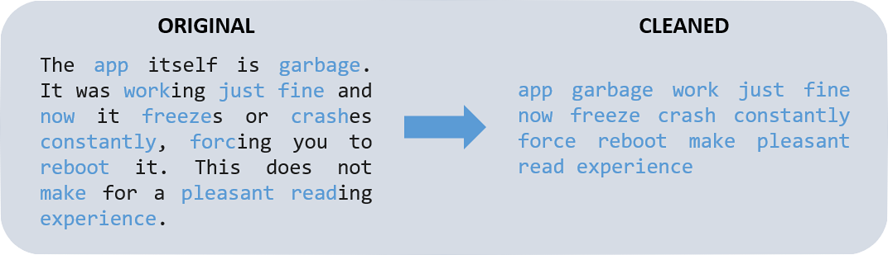

Today, companies are faced with huge volumes of unstructured text data in the form of social media posts, online reviews, emails, etc. Those data are key in answering questions like:

* **What does Twitter think of our brand?**

* **What key features are Amazon reviewers buzzing about?**

* **What pain points are users experiencing on our latest app?**

In this post, I'll showcase a few data science techniques we can use to answer those questions. We'll cover *exploratory data analysis ("EDA")*, as well as text mining techniques like *sentiment analysis* and *keyword extraction*. I'll be using *R* to download, analyze, and visualize key patterns in *Apple App Store reviews*. 

## Setup and Loading Data

```{r, include = FALSE}
# Package names
library(appler)
library(dplyr)
library(lubridate)
library(ggplot2)
library(stringr)
library(tidyr)
library(tm)
library(textclean)
library(textstem)
library(syuzhet)
library(knitr)
library(udpipe)
library(tidytext)
library(igraph)
library(ggraph)
library(ggplot2)
library(gridExtra)
library(wesanderson)
library(colorspace)
library(wordcloud)
library(ggrepel)

blue <- wesanderson::wes_palettes$Zissou1[1]
red <- wesanderson::wes_palettes$Royal1[2]
lightred <- lighten(red, amount = 0.5, method = 'relative', space = 'combined')
green <- wesanderson::wes_palettes$Royal2[5]
yellow <- wesanderson::wes_palettes$Royal2[4]
lightblue <- lighten(blue, amount = 0.5, method = 'relative', space = 'combined')
```

To start, we'll use the **appler** package to download the latest user reviews for a given app ID. As a webtoon enthusiast,  I'm a big fan of the [Tapas app](https://apps.apple.com/us/app/tapas-comics-and-novels/id578836126), so I'll be analyzing the reviews for their app!

(_disclaimer: the App Store API only allows users to download the latest 500 reviews. But even if you have thousands of reviews, you can still apply the same analyses!_)

```{r, eval = FALSE}
# App store ID can be found in the app store URL: https://apps.apple.com/us/app/tapas-comics-and-novels/id578836126
reviews <- appler::get_apple_reviews(578836126, country = 'us', all_results = TRUE)
```

```{r, include = FALSE}
# To ensure replicability, I saved the App Store reviews I downloaded.
# saveRDS(reviews_raw, file = 'app_reviews.rds')
reviews <- readRDS('app_reviews.rds')
```

Once we have the data downloaded, we can use dim() and head() to look at how large the dataset is, and what it looks like.
```{r, message = FALSE}
dim(reviews)
head(reviews, 3)
```
The dataset has 500 rows, with 7 variables. The variables we'll be working with most are review_time, app_version, rating, and review. 

## Exploratory Data Analysis
#### "What trends do we see over time?"

Before diving into any analysis, let's do some EDA get a sense of the data structure and what patterns might be worth exploring. To start, I looked at the distribution of data over the past few months.
```{r, echo = FALSE, message = FALSE}
reviews <- reviews %>% 
  mutate(review_time = as.Date(review_time), 
         month = lubridate::floor_date(review_time, 'month'),
         month_flag = month < '2021-05-01')

monthly_count <- reviews %>% group_by(month, month_flag) %>% summarize(n = n())

# 288 out of 500 reviews are from before May 2021
proportion <- monthly_count %>% 
  group_by(month_flag) %>% 
  summarize(total_n = sum(n)) %>% 
  filter(month_flag == TRUE) %>% 
  select(total_n)

my_palette <- c(lightblue, blue)

ggplot(monthly_count, aes(x = month, y = n, fill = month_flag)) + 
  geom_bar(stat = 'identity') + 
  labs(title = "More than half the reviews (288 out of 500) are from the first three months.",
       subtitle = "Monthly Count of Reviews",
       x = 'Month', 
       y = 'Count of Reviews') +
  theme_light() +
  theme(panel.grid.major = element_blank(), 
        panel.grid.minor = element_blank(), 
        legend.position = 'none') +
  scale_fill_manual(values = my_palette) +
  ylim(0, 150) + 
  scale_x_date(date_breaks = "1 month", date_labels =  "%b %y") +
  geom_text(aes(label = n), vjust = -0.5)
```

Interestingly, the majority of reviews are from early 2021, and it seems like fewer and fewer people left reviews for Tapas in recent months. It's  well-known that dissatisfied customers are highly likely to leave negative reviews, while satisified customers are unlikely to leave positive reviews. So the drop in reviews could also be seen as evidence of improvements in the app. What if we looked at the app's average rating over time?

```{r, echo = FALSE, message = FALSE}
avg_rating <- reviews %>% 
  mutate(month_flag = case_when(
    month %in% as.Date(c('2021-08-01', '2021-09-01', '2021-10-01')) ~ TRUE,
    T ~ FALSE
  )) %>%
  group_by(month, month_flag) %>% 
  summarize(avg_rating = mean(rating))

my_palette <- c(blue, red)

ggplot(avg_rating, aes(x = month, y = avg_rating, fill = month_flag))+
  geom_bar(stat = 'identity') +
  labs(title = 'Average ratings grew through July and fell in recent months.',
       subtitle = 'Monthly Average Rating',
       x = 'Month', 
       y = 'Average Rating') + 
  theme_light() +
  theme(panel.grid.major = element_blank(), 
        panel.grid.minor = element_blank(), 
        legend.position = 'none') +
  ylim(0, 5) +
  scale_x_date(date_breaks = "1 month", date_labels =  "%b %y") +
  scale_fill_manual(values = my_palette) +
  geom_text(aes(label = formatC(avg_rating, format = 'f', digits = 2)), vjust = -0.8)
```

Plotting ratings over time paints a similar narrative, that the Tapas app has generally improved over time. The average rating was steadily growing up until July 2021. But after that point, ratings took a dip, and by September, the average rating was essentially back where it started. The App Store provides data on app versions, so we can also look at ratings across different app versions. 
```{r, echo = FALSE}
reviews <- reviews %>% mutate(app_version_clean = stringr::str_extract(as.character(app_version), '5\\.[0-9]{1,2}'))

app_ver_order <- reviews %>% 
  select(app_version_clean) %>%
  unique() %>% 
  arrange(as.integer(substr(app_version_clean, 3, nchar(app_version_clean)))) %>%
  unlist()

reviews <- reviews %>% mutate(app_version_clean = factor(app_version_clean, levels = app_ver_order))
```

```{r, include = FALSE, message = FALSE}
version_count <- reviews %>% 
  group_by(app_version_clean, month) %>% 
  summarize(n_reviews = n()) %>%
  ungroup() %>%
  tidyr::complete(app_version_clean, month, fill = list(n_reviews = 0)) %>%
  arrange(app_version_clean)

version_prop <- version_count %>% 
  group_by(month) %>% 
  mutate(percentage = n_reviews/sum(n_reviews))

ggplot(version_prop, aes(x = month, y = percentage, fill = app_version_clean)) + 
  geom_area() + 
  labs(title = 'Ver. 5.10 was the active version around September.',
       subtitle = 'Version Rollouts Over Time',
       x = 'Month', 
       y = 'Percent of Reviews') +
  theme_light() +
  theme(panel.grid.major = element_blank(), 
        panel.grid.minor = element_blank()) +
  scale_x_date(date_breaks = "1 month", date_labels =  "%b %y") +
  scale_y_continuous(labels = scales::percent) + 
  scale_fill_discrete(name = 'App Version') + 
  geom_vline(xintercept = as.Date('2021-09-01'),
             linetype = 'dotted',
             size = 1.5)
```

When we plot average ratings by app version, we can see that version 5.10 had the lowest rating since version 5.5. 
```{r, echo = FALSE}
avg_rating_by_ver <- reviews %>% 
  group_by(app_version_clean) %>%
  summarize(avg_rating = mean(rating)) %>%
  arrange(app_version_clean)

ggplot(avg_rating_by_ver, aes(x = app_version_clean, y = avg_rating)) + 
  geom_bar(stat = 'identity', fill = blue) +
  labs(title = 'Average ratings peaked with ver. 5.9 and fell with ver. 5.10.',
       subtitle = 'Average Rating by App Version',
       x = 'App Version', 
       y = 'Average Rating') +
  theme_light() +
  theme(panel.grid.major = element_blank(), 
        panel.grid.minor = element_blank(),
        legend.position = 'none') +
  scale_fill_manual(values = my_palette) +
  ylim(0, 5) +
  geom_text(aes(label = formatC(avg_rating, format = 'f', digits = 2)), vjust = -0.8)
```

So we discovered that *Tapas ratings improved through the release of version 5.9 in July*, but *ratings have fallen in recent months for versions 5.10-5.12*.

## What's driving the negative reviews?

So far we've only looked at ratings, but there's a whole gold-mine of information we've yet to touch: the reviews! There are hundreds of ways you can analyze text data. I'll focus on **sentiment analysis** and **keyword extraction**, and we'll finish it up with a simple linear regression. 

### Text Cleaning and Sentiment Analysis
#### "How do we identify negative reviews?"

[Sentiment analysis](https://monkeylearn.com/blog/text-mining-sentiment-analysis/) is exactly what it sounds like: taking a body of text and determining whether the underlying sentiment is positive, negative, or neutral. With sentiment analysis, you can get a deeper understanding of public opinion about your company/product/service.

Sentiment analysis is helpful in this case because there can still be reviews with positive ratings, but the text itself is negative. For example, this 5-star review talks about an issue with the app crashing. If we filtered on rating, we wouldn't capture a review like this. So when identifying pain points, we'll want to use sentiment analysis to keep reviews like this in the population.
```{r}
reviews %>% filter(id == 7882943052) %>% select(rating, title, review)
```

Before we can run our sentiment analysis, we need to pre-process our text data. This often involves stripping punctuation, removing uninformative stop words (e.g., "the", "a", "and"), as well as other cleaning steps. Eventually, our "cleaned" reviews will look like this:
```{r, echo = FALSE, message = FALSE}
cleanText <- function(x){
  temp <- gsub('’','\'',x)
  temp <- replace_contraction(temp) #Replace contracted words with non-contracted words (e.g., "I'm" to "I am")
  temp <- gsub('\\n',' ', temp)
  temp <- gsub('[[:punct:]0-9 “”‘]+',' ', temp)
  temp <- sapply(temp, function(i) iconv(i, "latin1", "ASCII", sub=""))
  temp <- tolower(temp)
  temp <- lemmatize_strings(temp)
  temp <- removeWords(temp, c('app', 'tapa', stopwords(kind = 'en')))
  temp <- gsub('\\s+', ' ', temp)
}

reviews <- reviews %>% mutate(review_cleaned = cleanText(review))
#Show example: before and after
example <- reviews[5,]
```


After cleaning the text, I used the "syuzhet" package in R to calculate a sentiment "score" for each review. For example, words like "garbage" will get negative scores, while a word like "pleasant" gets a postive score. The total gets you to the overall score for the review. 
```{r, include = FALSE}
#Run get_sentiment on example review
example_words <- example %>% 
  unnest_tokens(output = word, input = review_cleaned, token = 'words') %>% 
  select(word)

example_sentiment <- example_words %>% mutate(sentiment_score = syuzhet::get_sentiment(word))
```

(_These scores are pulled from "lexicons" assembled by literary researchers. I'm using Syuzhet, [the default lexicon in the syuzhet package that was developed in the Nebraska Literary Lab](https://www.rdocumentation.org/packages/syuzhet/versions/1.0.6)._)

After we calculate a sentiment score for every review, we can identify "negative", "positive" or "neutral" reviews (i.e., reviews with a negative, positive, or zero sentiment score respectively). 

```{r, echo = FALSE, message = FALSE}
sentiment_order <- c('negative', 'neutral', 'positive')

reviews <- reviews %>% 
  mutate(sentiment_score = syuzhet::get_sentiment(review_cleaned, method = 'syuzhet'),
         sentiment_direction = case_when(
           sign(sentiment_score) < 0 ~ 'negative',
           sign(sentiment_score) > 0 ~ 'positive',
           sign(sentiment_score) == 0 ~ 'neutral'
           )
         ) %>%
  mutate(sentiment_direction = factor(sentiment_direction, levels = sentiment_order))
```
So if we saw relatively poor ratings on version 5.10, we should also see more negative sentiment. Sure enough, if we plot sentiment by app version, we see exactly that. 

```{r, message = FALSE}
sent_ver <- reviews %>% 
  group_by(app_version_clean, sentiment_direction) %>%
  summarize(percentage = n())

my_palette <- c(red, yellow, green)

ggplot(sent_ver, aes(fill = sentiment_direction, x = app_version_clean, y = percentage)) +  
  geom_bar(position = 'fill', stat = 'identity') +
  labs(title = 'Sentiment improved through ver. 5.9 but soured with recent updates.',
       subtitle = 'Sentiment by App Version',
       x = 'App Version', 
       y = 'Percent of Reviews') +
  theme_light() +
  theme(panel.grid.major = element_blank(), 
        panel.grid.minor = element_blank()) +
  scale_y_continuous(labels = scales::percent) + 
  scale_fill_manual(name = 'Sentiment', values = my_palette)
```

So what are these negative reviews talking about? If we look at a few examples, we can see some pain points that users are experiencing. 
```{r, include = FALSE}
#negative examples
knitr::kable(reviews %>% filter(sentiment_direction == 'negative') %>% head() %>% select(review, review_cleaned, sentiment_score))

#positive examples
knitr::kable(reviews %>% filter(sentiment_direction == 'positive') %>% head() %>% select(review, review_cleaned, sentiment_score))
```


As we can see, we were able to capture the example 5-star review as a negative review based on its sentiment score. So *in addition to ratings, we can also identify negative reviews based on sentiment score.* 

Crashes seem to be a common problem, while another user mentioned "ink", which is Tapas' in-app currency for purchasing premium content. Next, we'll use keyword extraction to identify what are the most common keywords that appear in negative reviews.

### Keyword Extraction
#### "What are common keywords among negative reviews?"

We saw that the issue of "crashes" appear commonly in the reviews, but are there other keywords that we should look for? There are many different algorithms/approaches for identifying key words/topics in text data. A popular approach is the ["Rapid Automatic Keyword Extraction"  ("RAKE") algorithm](https://monkeylearn.com/keyword-extraction/),  which identifies the most relevant words and phrases that commonly occur together (i.e., co-occurences).

For this step, I'll define "negative" reviews as those with (1) a rating lower than 3 stars, or (2) a rating with a negative sentiment score.
```{r, echo = FALSE}
negative_reviews <- reviews %>% filter(rating < 3 | sentiment_direction == 'negative')
```

I used r's "udpipe" package to run a RAKE algorithm on these negative reviews. The udpipe package lets us identify words that commonly occur with each other, and it identifies the part-of-speech for each word (i.e., nouns, adjectives, or verbs). 
```{r, echo = FALSE, message = FALSE}
udmodel <- udpipe::udpipe_download_model(language = 'english')
udmodel_english <- udpipe::udpipe_load_model(udmodel$file_model)
review_vector <- as.character(negative_reviews %>% select(review_cleaned))
complaint_detail <- udpipe_annotate(udmodel_english, review_vector)
complaint_data <- as.data.frame(complaint_detail)
```
One thing we can do is visualize a word "network", to see some of the most common nouns, adjectives, and verbs in the negative reviews and what other words are associated with them:
```{r, echo = FALSE}
## Co-occurrences: How frequent do words follow one another even if we would skip 2 words in between
stats <- udpipe::cooccurrence(x = complaint_data$lemma, relevant = complaint_data$upos %in% c('NOUN', 'ADJ', 'VERB'), skipgram = 2)
wordnetwork <- head(stats, 50)
wordnetwork <- graph_from_data_frame(wordnetwork)
ggraph(wordnetwork, layout = "fr") +
  geom_edge_link(aes(width = cooc, edge_alpha = cooc), edge_colour = red) +
  geom_node_text(aes(label = name), size = 4) +
  theme(legend.position = "none") +
  labs(title = "Most common co-occurrences among negative reviews.", subtitle = "Nouns, Adjectives, and Verbs")
```
From this word network, we see that the most common phrase is "read comic", which makes sense considering that Tapas is an app for reading comcis. We can also see some other interesting associations. The cluster with words like "freeze", "crash", "open", "load", or "time" indicates performance issues with the app crashing, or even issues with the time it takes to load. Another common association is "spend money", which may reflect complaints about Tapas' pay-wall for premium content. These insights are consistent with the example reviews we looked at before. 

There also seem to be positive associations: "love story" and "great comic" indicate that people enjoy the content on Tapas.

We can also plot common key phrases in a bar plot.
```{r}
stats <- keywords_rake(x = complaint_data, 
                       term = 'lemma', 
                       group = 'doc_id', 
                       relevant = complaint_data$upos %in% c('NOUN', 'ADJ', 'VERB'))

stats_chart <- stats %>% 
  head(15) %>% 
  arrange(rake) %>%
  mutate(keyword = factor(keyword, levels = keyword),
         perf_issue = grepl('freeze|crash|fix|bug|time|long', keyword))

my_palette <- c(lightblue, blue)

ggplot(stats_chart, aes(x = keyword, y = rake, fill = perf_issue)) + 
  geom_col() + 
  labs(title = 'Common keywords in negative reviews.',
       subtitle = 'Common keywords in negative reviews.',
       x = 'RAKE', 
       y = 'Keyword') + 
  theme_light() + 
  theme(panel.grid.major = element_blank(), 
        panel.grid.minor = element_blank(),
        legend.position = 'none') +
  scale_fill_manual(values = my_palette) +
  coord_flip()
```

The top phrases relate to the function of the app, but after that, most of the phrases seem related to performance issues. Namely, we can see that words/phrases like "fix bug", "keep freeze", and "long time" appear frequently in negative reviews. So it looks like *performance issues are the most common complaint in negative reviews.*

## Regression
#### "Do performance issues explain everything about why we get negative reviews?"

So did we crack the puzzle? Do performance issues really explain all the negative reviews? Or is something else at play?

As an initial step, now that we know that we can search for keywords like "freeze", "fix", "load", etc. to identify reviews related to performance issues, we can look at trends in these sort of reviews. Let's define the metric "Performance Issue Rate" as the percent of reviews with these "performance-issue" keywords.
```{r, echo = FALSE, message = FALSE}
reviews <- reviews %>% mutate(crash_flag = grepl('crash|freez|bug|fix|load', review_cleaned))

monthly_reviews <- reviews %>% group_by(month) %>% summarize(total_reviews = n())

crash_month <- reviews %>% 
  group_by(month, crash_flag) %>%
  summarize(n_reviews = n()) %>%
  filter(crash_flag == 1) %>%
  left_join(monthly_reviews) %>%
  mutate(percentage = n_reviews/total_reviews)

ggplot(crash_month, aes(x = month, y = percentage)) +  
  geom_bar(stat = 'identity', fill = red) +
  labs(title = 'Rate of performance issues has fallen from 87% to 48%.',
       subtitle = 'Percent of Reviews that Mention "Crash", "Freeze", "Bug", etc. by Month',
       x = 'Month', 
       y = 'Percent of Reviews') +
  theme_light() + 
  theme(panel.grid.major = element_blank(), 
        panel.grid.minor = element_blank(), 
        legend.position = 'none') +
  scale_x_date(date_breaks = "1 month", date_labels =  "%b %y") +
  scale_y_continuous(labels = scales::percent, limits = c(0,1)) +
  geom_text(aes(label = scales::percent(percentage, accuracy = 1L)), vjust = -0.8)
```


```{r, echo = FALSE, message = FALSE}
version_reviews <- reviews %>% group_by(app_version_clean) %>% summarize(total_reviews = n())

crash_ver <- reviews %>% 
  group_by(app_version_clean, crash_flag) %>%
  summarize(n_reviews = n()) %>%
  filter(crash_flag == 1) %>%
  left_join(version_reviews) %>%
  mutate(percentage = n_reviews/total_reviews)

ggplot(crash_ver, aes(x = app_version_clean, y = percentage)) +  
  geom_bar(stat = 'identity', fill = red) +
  labs(title = 'Performance has improved with each new app version.',
       subtitle = 'Percent of Reviews that Mention "Crash", "Freeze", "Bug", etc. by App Version',
       x = 'App Version',
       y = 'Percent of Reviews') +
  theme_light() +
  theme(panel.grid.major = element_blank(), 
        panel.grid.minor = element_blank(), 
        legend.position = 'none') +
  scale_y_continuous(labels = scales::percent, limits = c(0,1)) + 
  geom_text(aes(label = scales::percent(percentage, accuracy = 1L)), vjust = -0.8)
```

So it looks like the improvement in ratings is driven by improvements in app performance. We can see how much Performance Issue Rate affect ratings by running a quick OLS regression. 
```{r, echo = FALSE, message = FALSE}
regression_data <- crash_ver %>% left_join(avg_rating_by_ver)
myModel <- lm(avg_rating ~ percentage, data = regression_data)

lm_eqn <- function(df){
    eq <- substitute(italic(y) == a - b %.% italic(x)*","~~italic(r)^2~"="~r2, 
         list(a = format(unname(coef(myModel)[1]), digits = 2),
              b = format(unname(-coef(myModel)[2]), digits = 2),
             r2 = format(summary(myModel)$r.squared, digits = 3)))
    as.character(as.expression(eq));
}

ggplot(regression_data, aes(x = percentage, y = avg_rating)) +
  geom_smooth(method = "lm", se=FALSE, color="black", formula = y ~ x)+
  geom_point() +
  labs(title = 'Performance fixes explain 48% of the improvements in rating.',
       subtitle = 'Performance Issue Rate vs Average Rating from Ver. 5.5-5.12',
       x = 'Performance Issue Rate',
       y = 'Average Rating') +
  theme_light() +
  theme(panel.grid.major = element_blank(), 
        panel.grid.minor = element_blank(), 
        legend.position = 'none') +
  ylim(0,5) + 
  scale_x_continuous(labels = scales::percent, limits = c(0,1)) +
  geom_text_repel(aes(label = app_version_clean), vjust = -0.8) +
  geom_text(x = 0.25, y = 1, label = lm_eqn(df), parse = TRUE)
```
The regression shows that across all app versions, performance issues explain about 48 percent of the variance in ratings. It appears that the regression fits better for earlier app versions, but is not a great fit for versions 5.9, 5.10 or 5.12 (removing app versions 5.9, 5.10, and 5.12 bumps the R-squared up to 92 percent). This suggests that although performance explains most of the change in ratings for earlier app versions, other issues besides performance drove the drop in ratings for versions 5.10 and 5.12.  

```{r, include = FALSE}
myModel2 <- lm(avg_rating ~ percentage, data = regression_data %>% filter(!(app_version_clean %in% c('5.9', '5.10', '5.12'))))
summary(myModel2)
```

## Conclusion and Next Steps

From our EDA and text mining analyses on app reviews for the Tapas app, we've arrived at the following takeaways:

* **Ratings grew** from an average of 2.59 (ver 5.5) to 3.46 (ver 5.9), but fell with ver. 5.10 and 5.12.

* The growth in ratings were largely driven by **improved app performance.**

* **Other issues besides app performance** are driving the fall in ratings for the more recent updates (ver. 5.10 and 5.12.)

Hopefully this post showed you how data science techniques can help you explore and unlock deeper insights from your data. Of course, this post only touches on the surface of potential analyses we could run on the review data. Some next steps could include:

* Running a topic model on the reviews (e.g., LDA) to separate the reviews into key topics.

* Dive deeper into keywords for versions 5.10 and 5.12 to attempt to identify other problems that explain the drop in ratings.

* Use a web scraper (e.g., beautifulsoup in Python or rvest in R) to collect more reviews than the 500 max allowed by the Apple API.

